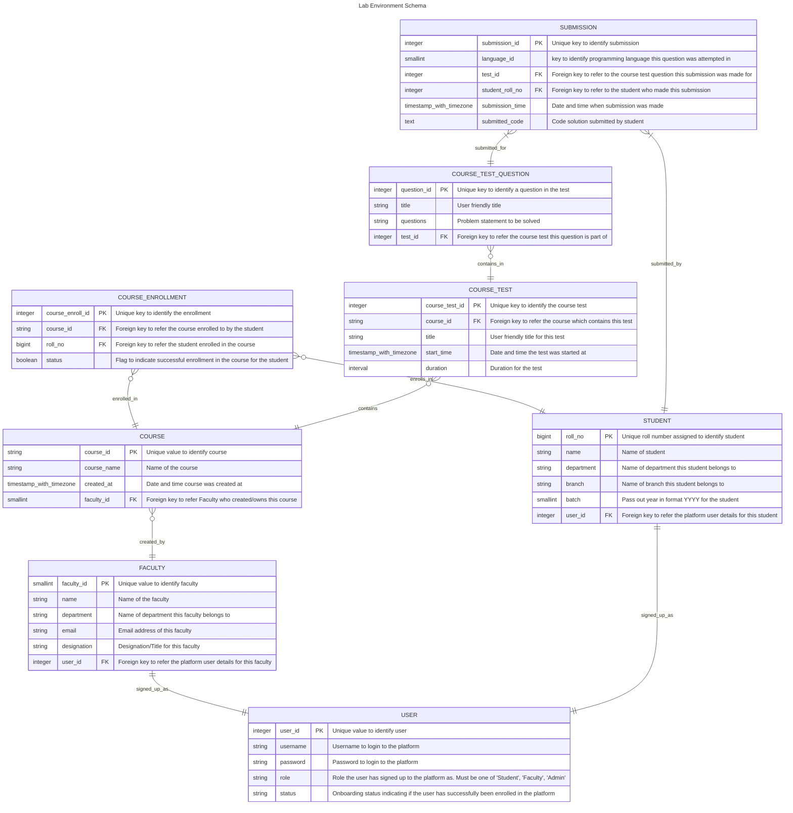

# Online Lab Environment Backend

## How to build in local

### Pre-requisites
1. JDK 25 (Preferably [Bellsoft Libertica Native image kit](https://bell-sw.com/pages/downloads/native-image-kit/#nik-25-(jdk-25)))
2. [gradle](https://gradle.org/)

### Setup in local
1. Clone the repo using ```git clone https://github.com/dineshsanthanam07/Online_Lab_Envi.git```
2. Switch to app directory ```cd Online_Lab_Envi```
3. Build the application by executing ```gradle build```

## ER Diagram
